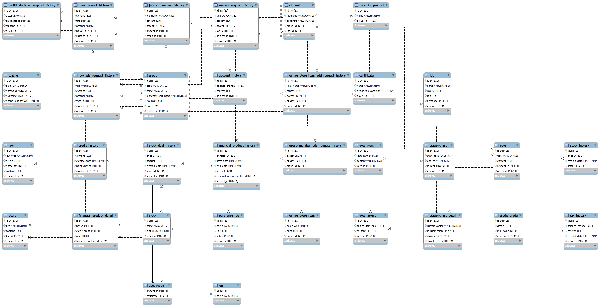

## ✔ 프로젝트 명

- 코멘캐시(komenCash)

---

## ✔ 주제

- 경제 학급 활동 지원 서비스

---

## ✔ 대상

- 초등학교 고학년(5~6학년?) : 어느 정도 경제 활동에 이해가 가능한 나이

- 초등학교 고학년 담임 선생님

---

## ✔ 문제 제기

- 많은 사람들이 주식, 재태크 등 부가 경제 활동에 전념

- 이러한 활동은 어디서도 배워본 적 없기 때문에 재태크를 처음 시작하는 사람들은 막막함을 느낌

- 어렸을 때부터 학급 활동으로 이런 경제 활동을 경험할 수 있는 기회가 있다면 좋지 않을까?

---

## ✔ 상세 기획

[KomenCash 기획서](https://www.notion.so/KomenCash-5e432ac66c964c74ae48d71b82ef8246#632443c7a6594c32a58fc1b8a0d4fc03)

---

## ✔ 팀원

| 이름   | 직책 | 역할       |
| ------ | ---- | ---------- |
| 배상웅 | 팀장 | 백엔드, 유니티 개발 |
| 고재석 | 팀원 | 백엔드     |
| 박수아 | 팀원 | 프론트엔드 |
| 정혜림 | 팀원 | 프론트엔드, 유니티 개발 |

---

## ✔ 기술 스택

- Back-end
    - SpringBoot, JPA, MySQL, Docker

- Front-end
    - HTML, vue.js, CSS, SCSS, Unity

</a>
</a>
</a>

</a>
</a>

</a>
</a>

---

## ERD

---