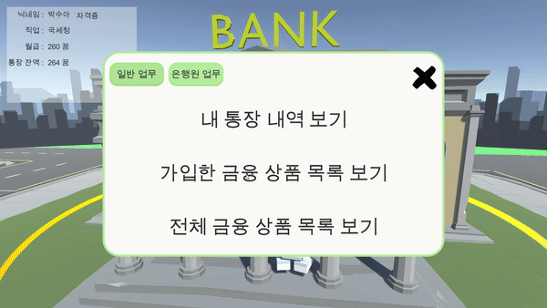
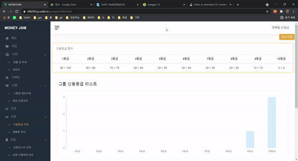

## ✔ 프로젝트 명

- 코멘캐시(KomenCash)팀 **Money Jam**

---

## ✔ 주제

- 경제 학급 활동 지원 서비스

---

## ✔ 대상

- 초등학교 고학년(5~6학년) : 어느 정도 경제 활동에 이해가 가능한 나이

- 초등학교 고학년 담임 선생님

---

## ✔ 문제 제기

- 많은 사람들이 주식, 재태크 등 부가 경제 활동에 전념

- 이러한 활동은 어디서도 배워본 적 없기 때문에 재태크를 처음 시작하는 사람들은 막막함을 느낌

- 어렸을 때부터 학급 활동으로 이런 경제 활동을 경험할 수 있는 기회가 있다면 좋지 않을까?

---

## ✔ 상세 기획

[KomenCash 기획서](https://www.notion.so/KomenCash-5e432ac66c964c74ae48d71b82ef8246#632443c7a6594c32a58fc1b8a0d4fc03)

---

## ✔ 팀원

| 이름   | 직책 | 역할                |
| ------ | ---- | ------------------- |
| 배상웅 | 팀장 | 백엔드, 유니티 개발 |
| 고재석 | 팀원 | 백엔드 , DB         |
| 박수아 | 팀원 | 프론트엔드(Vue.js)  |
| 정혜림 | 팀원 | 프론트엔드(Unity)   |

---

## ✔ 기술 스택

- Back-end

  - SpringBoot, JPA, MySQL, Docker

- Front-end
  - Unity, Vue.js, HTML,  CSS,  SCSS, 

</a>
</a>
</a>

</a>
</a>

</a>
</a>

---

## ERD

---

## ✔ 학생 페이지(Unity)

### 1. 선생님 페이지에서 학생용 파일 다운로드

### 2. 회원가입페이지

### 3. 로그인 페이지

### 4. 전체 페이지 구성

### 5. 국회

#### 투표 조회 및 생성과 투표하기

### 6. 은행

#### **은행원** 직장인 월급 지급

- 선생님이 월급 요청하면 직장을 가진 학생들한테 소득세 제외하고 월급을 보냅니다.

#### 학생 계좌 조회

#### 학생예금상품가입

#### 학생 예금상품조회 및 중도해지처리 가능

#### 은행원 예금가입 승인

### 7. 직업

#### 학생 이력서 쓰기

#### 학생 직업 추가 요청 보내기

### 8. 통계청

#### 통계청직원

> 통계청 직원이 제출물 내용을 작성하고, 학생들 제출내역을 관리합니다. 제출여부는 신용점수에 반영됩니다.

#### 8-1. 제출물 추가

#### 8-2 제출물 관리

#### 8-3. 제출물 조회

### 9. 국세청

#### 국세청직원

> 그룹의 세금을 관리합니다.

#### 세금 조회 및세금추가

### 10. 주식

#### 주식 내역 확인 및 매수, 매도

### 11. 상점

#### 물건 구매 및 내역 보기

### 12. 로그아웃

## ✔ 선생님 페이지(Vue.js)

### 1. AboutPage

### 2. 회원가입 페이지

### 3. 로그인 페이지

### 4. 아이디 / 비번 찾기

### 5. 그룹 리스트 페이지

> 그룹을 생성한 뒤 학생들이 그룹코드로 회원가입을 하면 그룹에 가입할 수 있습니다.

- 그룹생성 및 그룹코드 복사

- 튜토리얼

- 그룹원이 그룹코드로 가입 후, 그룹 가입 요청 수락

### 6. 국회

> 그룹만의 법률을 생성하여 보상과 벌을 그룹 법률에 기반하여 줄 수 있습니다. 
>
> 학생들이 올린 투표를 볼 수 있고, 차트로 결과를 확인할 수 있습니다.

#### 6-1. 법률 및 투표 페이지

- 헌법 튜토리얼

- 헌법 조회

- 헌법 추가 및 수정

- 학생 투표 결과 및 확인

#### 6-2.  경위서 페이지

- **경찰**직업을 가진 학생이 헌법을 어긴 학생의 벌금을 부과하여 선생님께 경위서를 제출합니다.

- 튜토리얼

-  목록

### 7. 직업

> 학생의 직업을 관리합니다. 정해진 일을 하고, 월급도 받으며 세금을 낼 수 있습니다. 아르바이트는 일회성 일로 돈을 추가로 받을 수 있습니다.

- 튜토리얼

- 직업추가

- 직업상세수정

- 학생 직업 지원 요청 이력서 확인 후 수락

- 학생 직업추가 요청 수락 -> 직업추가

- 아르바이트추가

- 월급날 **월급지급**버튼을 누르면 "은행원"이 월급 지급을 수락할 수 있습니다.

### 8. 국세청

> 그룹의 세금내역을 볼 수 있습니다. 
>
> 직업 월급을 받을 때 월급에서 나가는 소득세율을 수정할 수 있습니다.

- 튜토리얼

- 세금추가

- 소득세 수정

### 9. 은행

#### 9-1. 그룹원 전체 계좌

- 튜토리얼

- 그룹원 계좌 조회

- 그룹원 계좌에 입출금
  - `세금에서 입출금할까요?` 를 선택하면 세금에서 나가거나 세금으로 들어갑니다.

#### 9-2 예금상품

> 예금상품을 신용등급에 따라 금리를 다르게 설정할 수 있고, 수정 및 삭제가 가능합니다.
>
> 학생이 중도해지 요청을 하면 이자를 제외한 원금만 돌려줍니다.

- 예금상품 튜토리얼

- 예금상품 조회

- 예금상품 추가

- 예금상품 수정 및 삭제

- 학생 예금상품 신청 수락

- 학생 예금상품 중도해지 수락

### 10. 주식

> 학생들이 유추하기 쉽게 힌트를 주고 학생들에게 투자를 간접적으로 체험할 수 있게 해줍니다.

- 주식 튜토리얼

- 주식 추가

- 주식 내일의 힌트 변경 및 데이터 추가

### 11. 신용등급관리

>학생들의 신용등급을 차트로 볼 수 있습니다.  신용점수는 제출물을 제출 했을 때 선생님이 제출확인을 하면 1점씩 누적됩니다.

- 신용등급 튜토리얼

- 그룹원 신용등급 조회

- 제출물 튜토리얼

- 그룹원 제출물 조회 및 추가
  - 그룹원 제출 확인을 누르면 신용점수 1점이 올라감

### 12. 온라인 스토어

> 학생들이 직업, 아르바이트 등으로 번 돈을 쓸 수 있는 공간입니다. 

- 상점 튜토리얼

- 상품추가

- 상품거래내역 조회

### 13. 그룹관리

> 그룹의 정보를 수정할 수 있습니다.학생들이 얻을 수 있는 자격증 관리도 할 수 있고,   학생의 상세 정보도 조회 및 수정을 할 수 있습니다.

#### 13-1. 그룹정보 및 내정보

> 그룹정보를 수정 및 변경, 삭제가 가능합니다.
>
> 화폐단위를 변경할 수 있고, 소득세율, 물가상승률을 바꿀 수 있습니다.
>
> 물가상승률 변화시 그만큼 온라인 상점에 가격이 반영됩니다.

- 튜토리얼

- 그룹정보 수정 및 내정보 수정

#### 13-2. 자격증관리

- 그룹정보 튜토리얼

- 그룹자격증 추가

- 자격증 수정

#### 13-3 그룹원 정보

- 튜토리얼

- 그룹원 비밀번호 초기화

> 학생이 비밀번호를 잊었을 때 선생님이 비밀번호를 "1234"로 수정할 수 있습니다.

- 그룹원 직업 변경 및 자격증 변경

- 그룹원 예금 가입이력조회

